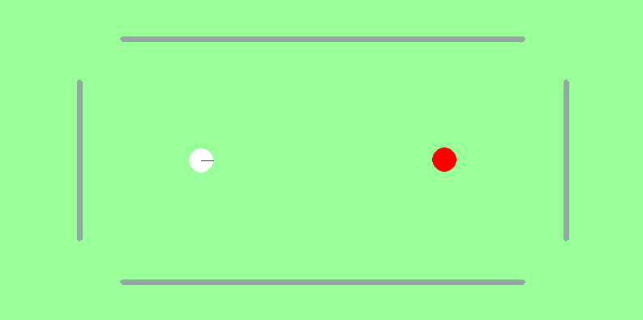
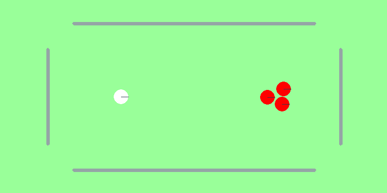
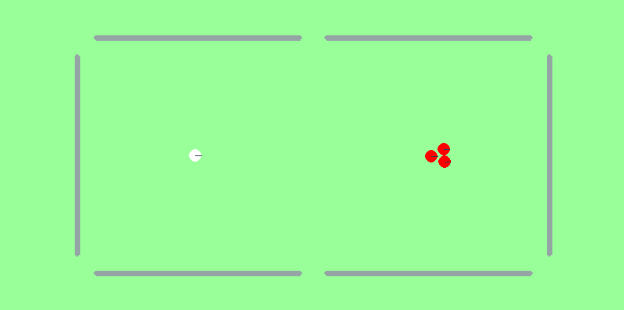

# CueSim
Simple simulated billiards enviornments that follow the Gymnasium API. The package exposes configurable physics, three difficulty settings, and heuristic agents. The environment can be run headless, or rendered in pygame.


## Environment Details

### Included Environments

<table>
  <colgroup>
    <col style="width:33%">
    <col style="width:33%">
    <col style="width:33%">
  </colgroup>
  <thead>
    <tr>
      <th scope="col">Cuesim/OneBall-v0</th>
      <th scope="col">Cuesim/ThreeBallEasy-v0</th>
      <th scope="col">Cuesim/ThreeBallRegulation-v0</th>
    </tr>
  </thead>
  <tbody>
    <tr>
      <td>One target ball on a small table.</td>
      <td>Three target balls on the same compact table.</td>
      <td>Three target balls on a full-size table.</td>
    </tr>
    <tr>
      <td></td>
      <td></td>
      <td></td>
    </tr>
  </tbody>
</table>

### Observations & Actions
- **Observation:** `gymnasium.spaces.Box` containing the `(x_i, y_i)` positions for the target ball (first) and then every target ball.
- **Action:** `gymnasium.spaces.Box` specifying the cue ball velocity; the environment normalizes this vector so only the shot direction matters.
- **Step Reward:** 1 if a target ball was pocketed, 0 otherwise. If the cue ball (white ball) is pocketed, the reward is zero and the cue ball gets repositioned on the table. Each episode lasts 10 steps, or until all balls have been pocketed.

## Installation

Clone the repository and install locally:

```bash
git clone https://github.com/giuschio/cue-sim-public.git
cd cue-sim-public
python -m pip install .
```

## Quick Start

```python
import gymnasium as gym
import cuesim

cuesim.register_gymnasium_environments()
env = gym.make("Cuesim/ThreeBallEasy-v0")

observation, info = env.reset(seed=42)
for _ in range(10):
    action = env.action_space.sample()
    observation, reward, terminated, truncated, info = env.step(action)
    if terminated or truncated:
        observation, info = env.reset()
```

Instantiate a custom environment directly if you want to tweak the physics or rewards:

```python
from cuesim.environments import BilliardsEnv, get_env_options

options = get_env_options("ThreeBallRegulation-v0", {"physics.render_dt": 0.01})
env = BilliardsEnv(seed=0, options=options, headless=True)
```

### Examples & Scripts
- `scripts/sb_train.py` and `scripts/sb_test.py`: train and test a simple SAC agent on the easiest environment
- `scripts/demo.py`: heuristic agent on the hardest environment.
